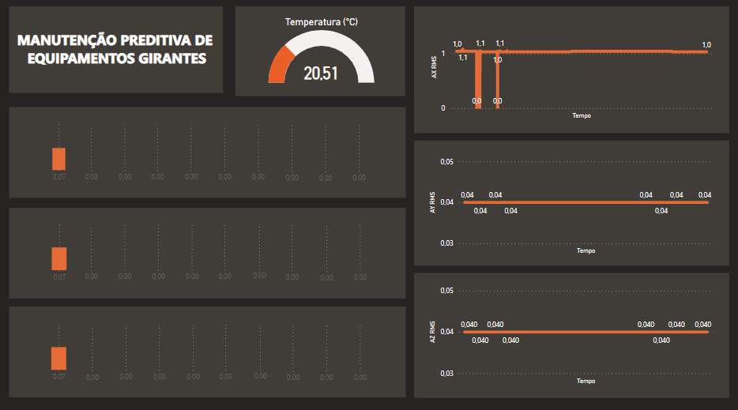

<div align="center">
<h1>Inteligência Industrial das Coisas (IIoT) <br> Manutenção Preditiva de Máquinas Girantes</h1>

</div>

## Problemática

Equipamentos girantes compõem diversas máquinas nos setores industriais, independentemente do ramo de atuação da planta. Ou seja, são largamente utilizados para diversas finalidades como automóveis, braços mecânicos, robôs, esteiras, prensas e em diversos outros tipos de maquinário pesado. 

Daí, quando estes equipamentos deterioram-se e não havendo o devido cuidado, as linhas de produção poderão ser repentinamente interrompidas ocasionado o ócio das cadeias de produção, redução de produtividade e lucratividade das indústrias. Aquém de atrasos de entregas, perdas de clientes e defeitos ainda graves e não previsíveis.

Efetuar a substituição de um equipamento antes da hora, ocasionará em prejuízos às margens de lucro da companhia. Mas também, deixar de realizar a manutenção dos equipamentos poderá trazer ainda mais prejuízos.

Então, ferramentas de análise para máquinas girantes poderão auxiliar na tomada de decisão, apontando falhas e estimando a vida útil restante dos equipamentos. Para que, possa ocorrer a manutenção preventiva do equipamento antes que ocorra uma falha crítica, assim minimizando os impactos na produção.

## Recursos
- Conectivade com a nuvem via Wi-Fi
- Dispositivo Azure IoT Hub
- Integração PowerBI
- Monitoramento de Vibração
- Monitoramento de temperatura
- Armazenamento Local
- Espectro do sinal



## Instalação

Algumas dependências possuem fácil instalação por meio de seus repositórios git de código aberto, e estão inclusas nesse repositório como módulos. Então é possível utilizar clonar esse módulo com os módulos incluídos a partir do comando abaixo.
```
git clone --recurse-submodules https://github.com/william-hazem/IIoT-Projeto-Manutencao-Preditiva-Maquinas-Girantes
```

* Adicione suas chaves da Azure em algum ponto em que a diretiva possa ser acessada pelo cabeçalho do `app/mqtt`
* Configure os parâmetros da conexão WiFi

## Componentes utilizados
* [Esp-32](https://www.alldatasheet.com/view.jsp?Searchword=Esp32%20datasheet&gclid=CjwKCAiA9qKbBhAzEiwAS4yeDeI7po4PLbK3pjVwZteYmlg82jyRDaVdivmHAtsPh1cijuFFRzoJ9xoCtMAQAvD_BwE)
* [Display Oled Ssd 1306](https://www.alldatasheet.com/view.jsp?Searchword=Ssd1306%20datasheet&gclid=CjwKCAiA9qKbBhAzEiwAS4yeDXkNi0S-0cQt8U6twi88OrERvhTNjdOnKnPOsK7tNTRjT_KVJQgxNhoCB9UQAvD_BwE)
* [Mpu Acelerômetro e Giroscópio MPU-6050](https://www.alldatasheet.com/view.jsp?Searchword=MPU-6050)
* [Sensor de temperatura LM35](https://www.alldatasheet.com/view.jsp?Searchword=Lm35%20datasheet&gclid=CjwKCAiA9qKbBhAzEiwAS4yeDcAv1BQVh7PaoJ-mTnymIodMIcGNu__R-WiTKMm82buFWD2Po9-bDxoCRxEQAvD_BwE)
* [Micro Sd Wemos D1 Mini Data Logger Shield + Relógio Rtc Ds1307](https://www.usinainfo.com.br/rtc-arduino/shield-data-logger-com-rtc-ds1307-para-wemos-d1-mini-6274.html)
* [Push Button](https://components101.com/switches/push-button)

### Ferramentas necessárias
* [vscode](https://code.visualstudio.com/)
* [extensão do vscode: platform.io](https://marketplace.visualstudio.com/items?itemName=platformio.platformio-ide)
* [git](https://git-scm.com/)

## Dependências
* [esp-idf-ssd1306](https://github.com/nopnop2002/esp-idf-ssd1306)
* [esp32-i2c-rw](https://github.com/gabrielbvicari/esp32-i2c_rw)
* [esp32-mpu6050](https://github.com/gabrielbvicari/esp32-mpu6050)
* [esp-idf-ds1307](https://github.com/nopnop2002/esp-idf-ds1307)
